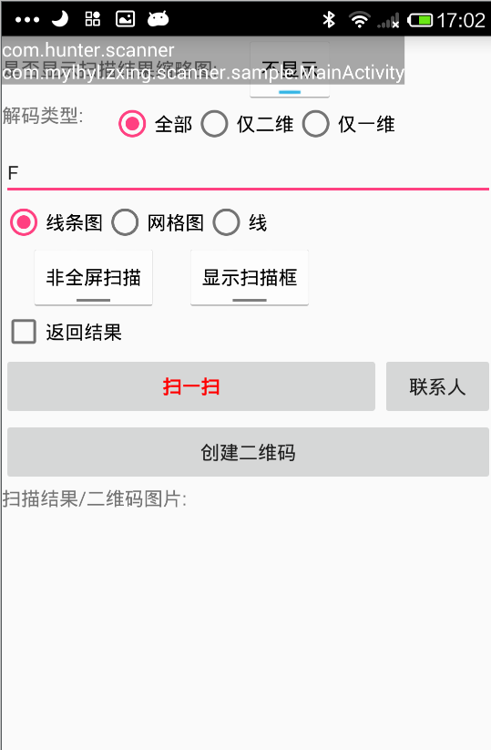
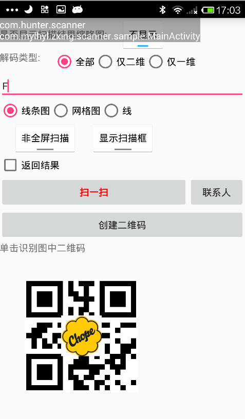
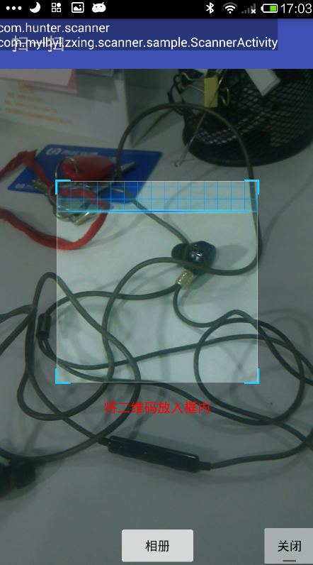
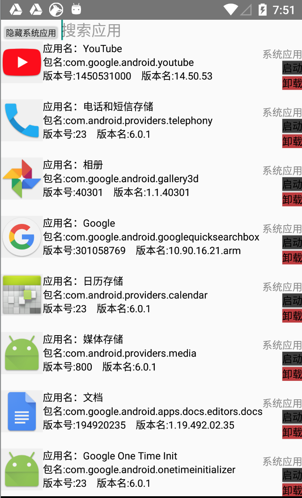

### 一、由来

项目本身来自 [Android-Zing](https://github.com/mylhyl/Android-Zxing) 项目的定制,感谢作者的付出。

### 二,作用
 
很简单，就是为了公司内部，测试QA人员方便进行二维码扫描。因为普遍的国外，原生Android系统的手机都
不内置带有二维码支持，而网上下载的二维码扫描工具很多都是夹杂广告的。。这个项目纯原生代码实现，
简洁高效，而且方便定制。

### 三，效果图

### 四，做了一个应用抽屉。作为一个 module在项目中。为了方便吧。

